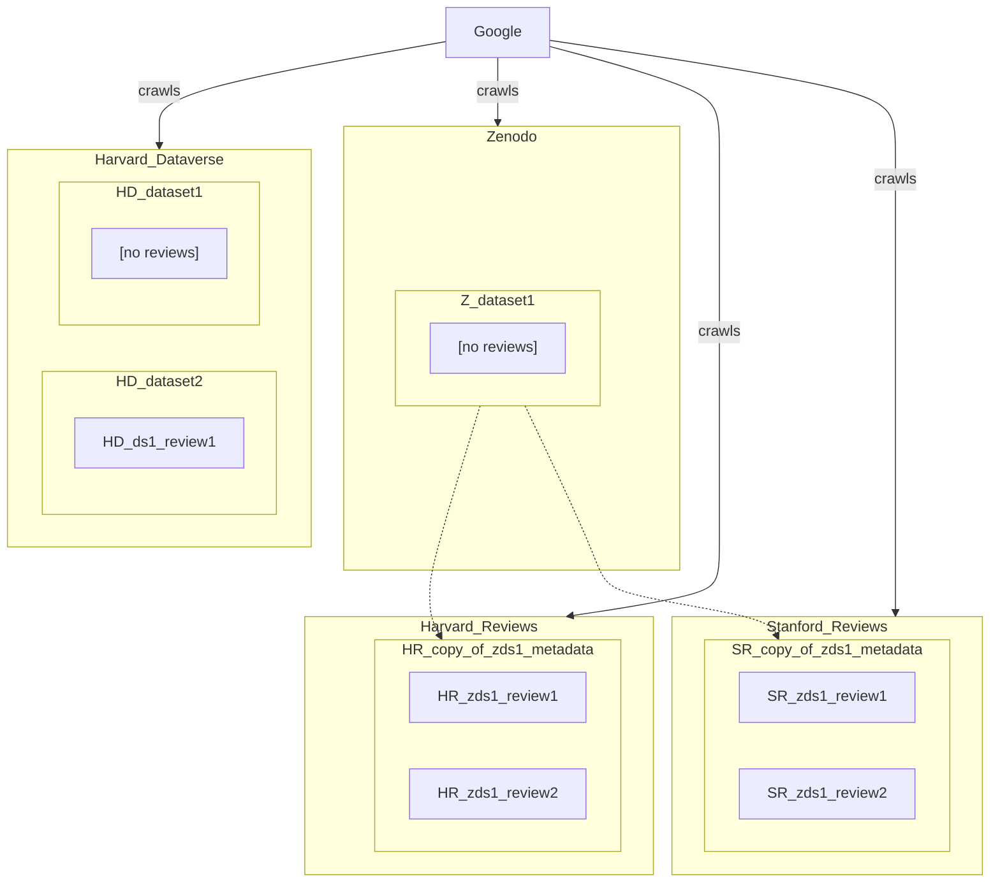

- Harvard Reviews is not running Dataverse. It's a separate app.
- When Google crawls, does it trust only reviews from Harvard Reviews? What about Stanford Reviews?
- In this scenario, Dataverse (including Harvard Dataverse) supports reviews of datasets it controls.
- What if Stanford Reviews starts reviewing datasets from Harvard Dataverse? Does Google trust those reviews?
- What happens when Zendo start supporting reviews? Does Google start aggregating reviews?