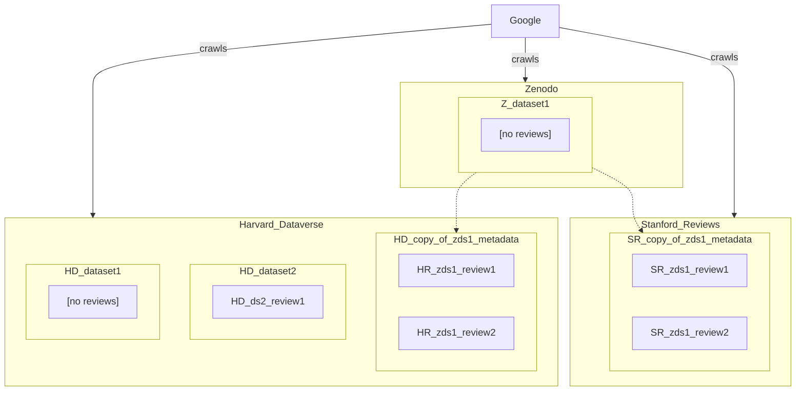

- In this scenario, the Dataverse supports foreign datasets where the metadata is copied and reviews can be attached.
- How does Google handle reviews from both Harvard Dataverse and Stanford Reviews?
- What if Zenodo start supporting reviews?