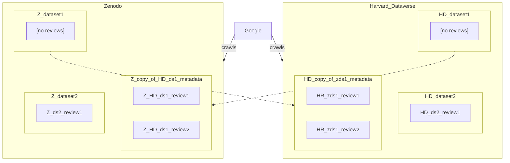

```mermaid
flowchart TD
Google
subgraph Harvard_Dataverse
  subgraph HD_copy_of_zds1_metadata
  HR_zds1_review1
  HR_zds1_review2
  end
  subgraph HD_dataset1
  no_reviewsHD@{ shape: rect, label: "[no reviews]" }
  end
  subgraph HD_dataset2
  HD_ds2_review1
  end
end
subgraph Zenodo
  subgraph Z_dataset1
  no_reviewsZ@{ shape: rect, label: "[no reviews]" }
  end
  subgraph Z_copy_of_HD_ds1_metadata
  Z_HD_ds1_review1
  Z_HD_ds1_review2
  end
  subgraph Z_dataset2
  Z_ds2_review1
  end
end

Google -- crawls --> Zenodo
Google -- crawls --> Harvard_Dataverse
Z_dataset1 -.-> HD_copy_of_zds1_metadata
HD_dataset1 -.-> Z_copy_of_HD_ds1_metadata
```
- In this scenario, both Dataverse and Zenodo have implemented reviews of internal and external datasets.
- Does Google aggregate the reviews?