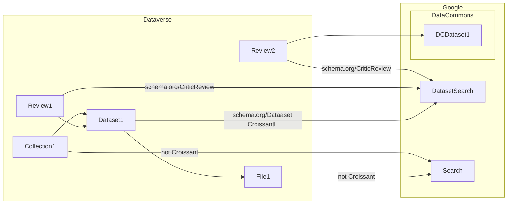

```mermaid
flowchart LR
subgraph Google
subgraph DataCommons
DCDataset1
end
DatasetSearch
Search
end

subgraph Dataverse
Collection1 --> Dataset1 
Collection1 -- not Croissant --> Search
Review2 --> DCDataset1
Review2 -- schema.org/CriticReview --> DatasetSearch
Dataset1 --> File1
File1 -- not Croissant --> Search
Review1 --> Dataset1 
Review1 -- schema.org/CriticReview --> DatasetSearch
Dataset1 -- schema.org/Dataaset Croissant🥐 --> DatasetSearch
end
```
