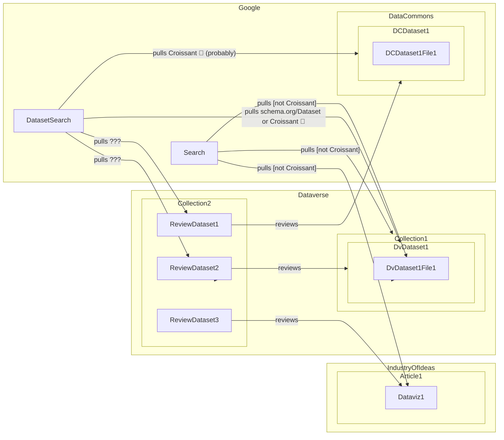

```mermaid
flowchart LR
subgraph Google
subgraph DataCommons
subgraph DCDataset1
DCDataset1File1
end
end
DatasetSearch
Search
end

subgraph IndustryOfIdeas
subgraph Article1
Dataviz1
end
end


subgraph Dataverse
subgraph Collection1
subgraph DvDataset1
DvDataset1File1
end
end
subgraph Collection2
ReviewDataset2
ReviewDataset1
ReviewDataset3
end
Collection1 --> DvDataset1 
Collection2 --> ReviewDataset2 
ReviewDataset1 -- reviews --> DCDataset1
ReviewDataset2 -- reviews --> DvDataset1 
ReviewDataset3 -- reviews --> Dataviz1
DatasetSearch -- pulls schema.org/Dataset or Croissant 🥐 --> DvDataset1
DatasetSearch -- pulls Croissant 🥐 (probably) --> DCDataset1
DatasetSearch -- pulls ??? --> ReviewDataset1
DatasetSearch -- pulls ??? --> ReviewDataset2
Search -- pulls [not Croissant] --> Collection1
Search -- pulls [not Croissant] --> DvDataset1File1
Search -- pulls [not Croissant] --> Dataviz1
end
```