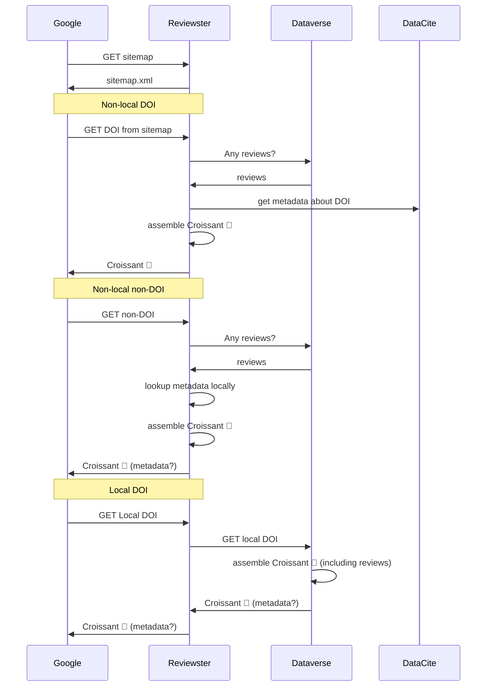

```mermaid
sequenceDiagram
    Google->>Reviewster: GET sitemap
    Reviewster->>Google: sitemap.xml
    Note over Google,Reviewster: Non-local DOI
    Google->>Reviewster: GET DOI from sitemap
    Reviewster->>Dataverse: Any reviews?
    Dataverse->>Reviewster: reviews
    Reviewster->>DataCite: get metadata about DOI
    Reviewster->>Reviewster: assemble Croissant 🥐
    Reviewster->>Google: Croissant 🥐
    Note over Google,Reviewster: Non-local non-DOI
    Google->>Reviewster: GET non-DOI
    Reviewster->>Dataverse: Any reviews?
    Dataverse->>Reviewster: reviews
    Reviewster->>Reviewster: lookup metadata locally
    Reviewster->>Reviewster: assemble Croissant 🥐
    Reviewster->>Google: Croissant 🥐 (metadata?)
    Note over Google,Reviewster: Local DOI
    Google->>Reviewster: GET Local DOI
    Reviewster->>Dataverse: GET local DOI
    Dataverse->>Dataverse: assemble Croissant 🥐 (including reviews)
    Dataverse->>Reviewster: Croissant 🥐 (metadata?)
    Reviewster->>Google: Croissant 🥐 (metadata?)
```
